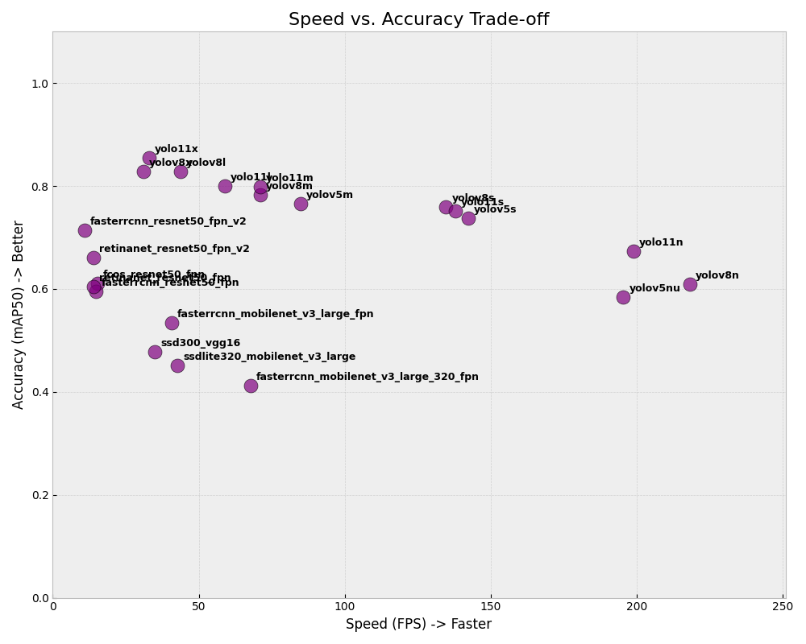
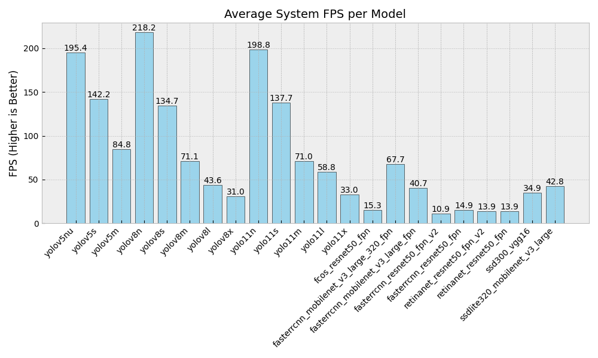
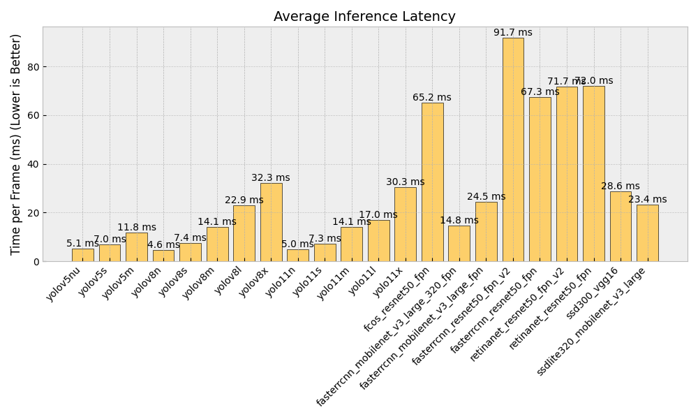

# 🚀 ComputerVisionComparator

**Automated benchmarking tool for Object Detection models (YOLO vs. Torchvision).** Compare **Speed (System FPS)**, **Accuracy (mAP)**, and **Latency** on your local hardware.


---

## About The Project

**ComputerVisionComparator** is a CLI engineering tool designed to empirically verify how Deep Learning models perform on specific consumer hardware. Unlike official server-side benchmarks, this tool measures:
1.  **System FPS:** The real-world performance including video decoding, preprocessing, inference, and postprocessing.
2.  **Accuracy:** Automated validation against the COCO dataset (mAP@0.50).
3.  **Hardware Utilization:** Auto-detects CUDA (Nvidia), MPS (Apple Silicon), or CPU.

It supports two major ecosystems using an **Adapter Pattern**:
* **Ultralytics:** YOLOv5, YOLOv8, YOLOv11.
* **Torchvision:** Faster R-CNN, SSD, RetinaNet.

---

## Key Features

* **Multi-Backend Support:** Seamlessly switch between YOLO and PyTorch models.
* **Automated Data Management:** Automatically downloads test videos and the COCO validation dataset if missing.
* **Cross-Platform:** Optimized for **Nvidia GPUs (CUDA)** and **MacBooks (M1/M2/M3 Metal/MPS)**.
* **Advanced Reporting:** Generates XML reports and matplotlib visualizations (FPS, Latency, Trade-off plots).
* **Live Demo Mode:** Visual verification of detection quality via webcam or video files.

---

## Benchmark Environment

All benchmarks presented below were conducted on the following high-performance workstation:

| Component | Specification |
| :--- | :--- |
| **CPU** | AMD Ryzen 7 9800X3D (3D V-Cache) |
| **GPU** | NVIDIA RTX 2060 Super (8GB VRAM) |
| **RAM** | 32 GB DDR5 6000 MHz CL30 |
| **Storage** | Samsung NVMe M.2 SSD 980 |
| **OS** | Fedora 43 |

---

## Benchmark Results

Here are the results generated directly by the tool on the hardware listed above.

### 1. Speed vs. Accuracy Trade-off
*This chart identifies the "Sweet Spot" models — high speed with acceptable accuracy.*



### 2. System FPS Comparison
*Real-world frames per second on video stream.*



### 3. Inference Latency (ms)
*Time required to process a single frame (Lower is better).*



*(Note: Images above are placeholders. Run the benchmark to generate your own charts in the `Reports/` directory).*

---

## Installation

1.  **Clone the repository**
    ```bash
    git clone https://github.com/Justyn001/ComputerVisionComparator.git
    cd ComputerVisionComparator
    ```

2.  **Create a virtual environment**
    ```bash
    python3 -m venv venv
    source venv/bin/activate  # On Windows: venv\Scripts\activate
    ```

3.  **Install dependencies**
    ```bash
    pip install -r requirements.txt
    ```

---

## Usage

### 1. Run Full Benchmark (All Models)
To test every supported model (YOLO family + Torchvision models) and generate full reports:
```bash
python benchmark.py --all
```
### 2. Test Specific Models
You can select specific models to compare:

```bash
python benchmark.py -m yolov8n yolov8s fasterrcnn_resnet50_fpn
```
### 3. Live Visual Demo
Want to see how the model "sees" the world? Run the live demo on your webcam (0) or a video file.

```bash
# Webcam
python benchmark.py --demo yolov11n --source 0

# Video file
python benchmark.py --demo yolov8m --source traffic_cut.mp4
```
## Project Structure

```bash
ComputerVisionComparator/
├── benchmark.py           # Main entry point (CLI)
├── runners/               # Model Adapters
│   ├── ultralytics_runner.py  # Wrapper for YOLO
│   └── torchvision_runner.py  # Wrapper for PyTorch models
├── utils/                 # Helper modules
│   ├── device_manager.py  # CUDA/MPS/CPU selection
│   ├── plot_generator.py  # Matplotlib graphing
│   ├── report_generator.py# XML reporting
│   └── live_demo.py       # Visualization logic
├── data/                  # Downloaded test videos
├── models/                # Downloaded model weights (.pt)
└── Reports/               # Output charts and XML logs
```

## License
This project is licensed under the **AGPL-3.0 License**. See the LICENSE file for details.

## Author
Justyn Rojkowski - Machine Learning Engineer & Computer Science Student

Project created as part of an Engineering Thesis: "Real-time object detection in a video stream using deep learning models".


